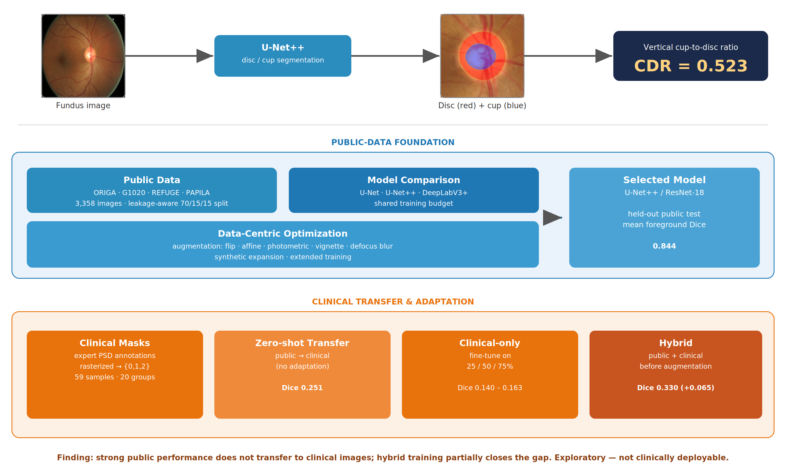

<h1 align="center">Automated Glaucoma Screening Using AI-Enhanced Ophthalmoscopy</h1>

<p align="center">
    <b>Optic disc & cup segmentation and cup-to-disc ratio estimation from retinal fundus images</b><br>
    <i>An honest study of public-to-clinical transfer</i>
</p>

<p align="center">
    
    
    
    <a href="https://rjashby1.github.io/Automated-Glaucoma-Screening-Using-AI-Enhanced-Ophthalmoscopy/">
  </a>
  <a href="https://huggingface.co/spaces/tyhob/Automated-Glaucoma-Screening-Using-AI-Enhanced-Ophthalmoscopy">
  </a>
</p>

> ⚠️ **Research use only — not a medical device.** This project does not diagnose glaucoma and must not be used for clinical decisions. It reports structural measurements (segmentation and cup-to-disc ratio), not a diagnosis.

## 🔥 A Quick Overview

Glaucoma is a leading cause of irreversible blindness, and the **vertical cup-to-disc ratio (CDR)** — derived from optic nerve head segmentation — is a key structural screening marker. This project builds a reproducible pipeline that segments the optic **disc** and **cup** from fundus images, computes the vertical CDR, and rigorously tests whether a model trained on public data transfers to real clinical images from the UVA Department of Ophthalmology.

<div align="center"></div>

## 🎯 Objective

- Segment optic nerve head features (disc and cup) from retinal fundus images
- Compute the vertical cup-to-disc ratio as a structural screening measurement
- Measure how public-data models transfer to clinical images, and whether limited clinical data can close the gap

## 👥 Authors

Robert Judson Ashby\
Tyler Hobbs\
Emmanuel Gyamfi\
Michael Ieraci

Sponsor: Dr. Arjun Dirghangi\
Faculty Mentor: Dr. Aiying Zhang\
In collaboration with UVA Research Computing (Rivanna/Afton)

## 🗂️ Datasets

**Public** (via Kaggle) — 3,358 fundus images with disc/cup annotations:

| Dataset | Images |
|---|---|
| ORIGA | 650 |
| G1020 | 1,020 |
| REFUGE | 1,200 |
| PAPILA | 488 |

**Clinical** — de-identified fundus images from the UVA Department of Ophthalmology, accessed under a data-use agreement with required human-subjects training. Ground truth was derived from clinically provided PSD annotations (59 mask-ready samples, 20 patient/encounter groups). **This data is private and is not included in this repository.**

## ⚙️ Preprocessing

- Images resized to 256×256 (bilinear); masks resized with nearest-neighbor interpolation
- Pixel values scaled to `[0, 1]`; no ImageNet normalization (encoders trained from scratch)
- Masks encoded as `0 = background, 1 = disc, 2 = cup`
- ORIGA, G1020, and PAPILA used reproducible leakage-aware, group-wise 70/15/15 splits; REFUGE’s official train/validation/test partitions were preserved.

## 🧠 Models

Three encoder–decoder architectures were compared under a shared training budget via `segmentation_models_pytorch`, then architecture was held fixed while data-centric strategies (augmentation, synthetic expansion, extended training) were varied.

- **U-Net** — symmetric encoder–decoder with skip connections
- **U-Net++** — nested, dense skip pathways *(selected model, ResNet-18 encoder)*
- **DeepLabV3+** — atrous spatial pyramid pooling with a lightweight decoder

Training used a combined **Dice + cross-entropy** loss.

## 🧪 Data-Centric Optimization
 
With the architecture held fixed, we varied the *data* pipeline rather than the model to see how far a public-data segmenter could be pushed:
 
- **Online augmentation** — horizontal flip, small affine warps, photometric perturbation, and combinations such as affine + vignette illumination + defocus blur. Augmentation was applied to the training split only; validation and test stayed deterministic. The screen identified a stable combined recipe that was carried forward rather than producing a large standalone jump.
- **Synthetic expansion** — a virtual strategy that increases the effective size of the training set without materializing synthetic image files on disk, used to probe data-scaling behavior.
- **Extended training** — the selected recipe retrained on a longer 25-epoch schedule. This produced the clearest public gain, improving held-out mean foreground Dice from **0.818 → 0.842**.

## 📊 Results

| Evaluation | Metric | Value |
|---|---|---|
| Long-trained public-only model | Public test mean foreground Dice | **0.842** |
| Zero-shot on **clinical** images | Patient-weighted Dice | **0.251** |
| Hybrid model | Public test mean foreground Dice | **0.844** |
| Hybrid clinical adaptation | Patient-weighted Dice | **0.265 → 0.330** |
| Hybrid clinical adaptation | CDR absolute-error reduction | **0.122** |

- A strong public model (**0.844** Dice) drops sharply on clinical images (**0.251**) — a large domain gap
- Clinical-only fine-tuning did **not** improve over zero-shot at any fraction
- **Hybrid** public + clinical training partially closed the gap while preserving public performance
- The system is exploratory and **not clinically deployable**

## 🚀 Live Demo

Try the interactive segmentation demo (public-data model) on Hugging Face Spaces:

**https://huggingface.co/spaces/tyhob/Automated-Glaucoma-Screening-Using-AI-Enhanced-Ophthalmoscopy**

Upload a retinal fundus image and the app returns the predicted optic disc and cup
segmentation, a zoomed view of the optic nerve head, and the derived vertical
cup-to-disc ratio. It runs the public-data model (U-Net++ / ResNet-18) on CPU —
no clinical data or clinically-trained weights are used.

## 🧐 Setup

```bash
git clone https://github.com/Rjashby1/Automated-Glaucoma-Screening-Using-AI-Enhanced-Ophthalmoscopy.git
cd Automated-Glaucoma-Screening-Using-AI-Enhanced-Ophthalmoscopy

conda env create -f environment.yml
conda activate glaucoma-capstone
pip install -e .
```

Run the notebooks in numbered order. Notebooks 00–07 develop and select the publicly available-data model; Notebook 08 performs the initial clinical generalization evaluation; Notebooks 09–10 extend public-data training; Notebooks 11–13 evaluate clinical transfer and adaptation; and Notebook 14 produces the final public-safe synthesis.

## 🔮 Future Work

- ImageNet-pretrained encoders (with matched normalization) to strengthen transfer
- A larger, segmentation-ready clinical dataset — the highest-value next step
- Consistent Disc-Dice definition across public and clinical evaluation
- Progress from CDR toward automated DDLS scoring, and from still frames to video ophthalmoscopy

## 📁 File Structure

```
.
├── notebooks/                       # 00–14: setup → public models → clinical transfer → synthesis
├── src/glaucoma_segmentation/
│   ├── data/                        # Manifests, splits, dataset classes
│   ├── nets/                        # Model factory and losses
│   ├── training/                    # Training loop
│   ├── evaluation/                  # Dice / IoU / CDR metrics
│   ├── augmentation/                # Online augmentation presets
│   ├── clinical/                    # Clinical PSD annotation handling (private data)
│   └── utils/                       # Device and seeding helpers
├── configs/                         # Configuration
├── reports/                         # Public-safe result tables and figures
├── README_Visualizations/           # Visualizations
└── Automated_Glaucoma_Screening_Using_AI_Enhanced_Ophthalmoscopy.pdf      # IEEE research paper detailing project work
```

> `data/`: Raw imagery, private clinical data, and PHI-adjacent artifacts are not tracked. Selected public-safe processed manifests are version-controlled for reproducibility. Public datasets are downloaded via the setup pipeline; clinical data is private and never committed.

## 🙏 Acknowledgments

Thanks to the **UVA Department of Ophthalmology** for project sponsorship and access to de-identified clinical data, and to **UVA Research Computing** (Rivanna/Afton) for compute resources.

## 📄 License

Code is released under the MIT License (see `LICENSE`). This covers the code only — public datasets remain under their original licenses, and clinical data is private and not distributed.
